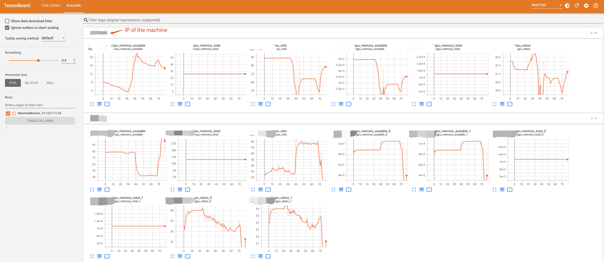

# LISTEN : LInux Server moniTor by rEcordiNg running status

-------

## Overview


This library implements a python script that automatically monitors the running status of a group of linux servers. Current adapted recording data includes:

- CPU utilization
- RAM
- Storage memory
- GPU utilization (only when nvidia-smi is available)
- GPU memory (only when nvidia-smi is available)

There are several key fetures of LISTEN system:
- Dynamic: during the monitoring process, both the linux servers being monitored and the data to be recorded could be dynamically added by editting the configuration files.
- Autonomy: apart from embedded data to be recorded (i.e., CPU utilization), you can customize any data you want to record.

--------

## How to monitor

Install dependencies:

```bash
pip install requirements.txt
```

Configure linux server to be monitored in ./config/monitor_config.json, here is an example:

```json
{
    "192.168.1.1":{
        "user": "panda"
    },
    "192.168.2.1":{
        "user": "cat",
        "port": 3456
    }
}
```

If 'port' is not assigned, LISTEN will use default one (22).

Configure ssh login for remote linux server:

```bash
ssh-copy-id panda@192.168.1.1
```

Note that all server you want to monitor should be configured passward-free login.

Then you can start monitoring running background:
```bash
nohup python monitor.py >> ./log/running.log 2>&1 &
```

Finally, all monitor data will be automatically recorded into tensorboard, which can be accessed by:

```bash
tensorboard ./log --port 5555
```

and check them in the browser:

```bash
localhost:5555
```

Here is an example for successful monitoring:


--------

## More feature to be explored:

LISTEN supports different levels of printing logs, which can be included by input '--verbose' when running python script. See ./utils/argsparser.py for more information.